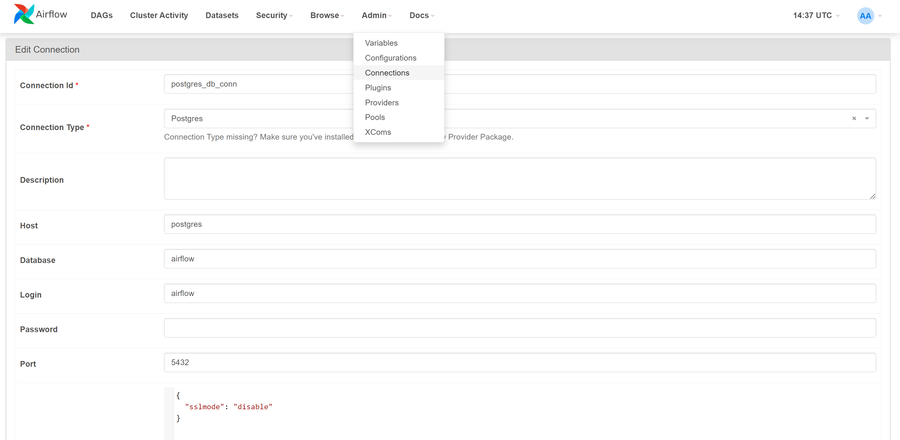
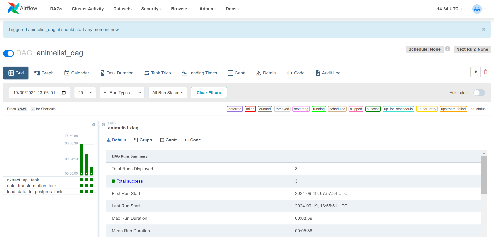

# Anime ETL Pipeline Project with Airflow

## Overview
This project demonstrates the use of Apache Airflow for building an ETL (Extract, Transform, Load) pipeline. The pipeline extracts anime data from the Jikan API, transforms the data using Pandas, and loads the cleaned data into a PostgreSQL database. Although the example uses anime data, the structure is designed to be flexible and can accommodate data from any RESTful API source.

## Project Structure
The project consists of the following components:
1. Airflow DAG (`animelist_dag.py`):
    * Defines the ETL workflow, including tasks for data extraction, transformation, and loading.
    * Uses Python Operators to call specific functions for each stage of the ETL process.
2. Docker Compose Configuration (`docker-compose.yaml`):
    Sets up the necessary services, including Airflow and PostgreSQL, for the pipeline to run seamlessly in a containerized environment.
3. Python Functions:
    * `web_extract`: Extracts data from the Jikan API for anime seasons from 2020 to 2023 and saves it in a Pandas DataFrame.
    * `data_transformation`: Cleans and transforms the extracted data by removing unnecessary columns and filling missing values.
    * `load_into_postgres`: Loads the cleaned data into a PostgreSQL database under the `transformed_data` schema.

## Requirements
To run this project, you need:
1. Docker & Docker Compose: To set up the Airflow and PostgreSQL services.
2. Python 3.7+: For the ETL scripts.
3. Apache Airflow: To manage and schedule the ETL pipeline.
4. Pandas Library: For data transformation.

## Setup Instructions
### 1. Install the Required Python Packages
Clone the project repository:
```
git clone https://github.com/yovinasilvia/ETL-1-Airflow-Pandas-PostgreSQL.git
cd <local-project-directory>
```
### 2. Create a Virtual Environment
Before starting the project, it's recommended to create a virtual environment to manage the dependencies in your local project directory:
```
python -m venv .venv
source .venv/Scripts/activate
```
### 3. Install the Required Python Packages
Install the necessary Python libraries:
```
pip install pandas requests apache-airflow
```
### 4. Build and Start the Docker Containers
Use the provided `docker-compose.yml` to set up Airflow and PostgreSQL:
```
docker-compose up -d
```
### 5. Access the Airflow UI
Go to default `http://localhost:8080` or on this project use `http://localhost:8082`, you can customize it and log in with the default credentials:
* Username: `airflow`
* Password: `airflow`

### 6. Configure Airflow Variables
Set up the PostgreSQL Connection
1. Navigate to the Admin -> Connections menu in the Airflow UI.
2. Click on the 'Create' button to add a new connection.
3. Enter the following details:
    * Connection Id: `postgres_db_conn`
    * Connection Type: `Postgres`
    * Host: `postgres` (the name of the service defined in the docker-compose.yaml)
    * Schema: `airflow` (the database name to connect to)
    * Login: `airflow`
    * Password: `airflow`
    * Port: `5432`
    * Extras:
        ```
        {
            "sslmode": "disable"
        }
        ```
This configuration allows Airflow to connect to the PostgreSQL database running in the Docker container.


### 7. Create File and Run the DAG
1. Create a file named `project_dag.py` in dags folder and add the following code to it [project_dag](dags/project_dag.py)
2. Trigger the `animelist_dag` from the Airflow UI to start the ETL process. If the DAG runs successfully, the Airflow UI will display the following:


## Customization for Other APIs
This project is designed to be flexible and can be adapted to extract data from other APIs by modifying the `web_extract` function and adjusting the transformation logic as needed.
### Steps to Customize:
1. Modify the `web_extract` Function:
    * Change the `url` in the `web_extract` function to point to the desired API endpoint.
    * Update any headers or parameters required for the new API.
2. Adjust the data_transformation Function:
    Customize the transformation logic to match the structure of the new data. Remove unnecessary columns, handle missing values, and perform any additional data transformations as needed.
3. Update the load_into_postgres Function:
    Modify the target table and schema names in the load_into_postgres function to reflect the new data structure.
### Example Use Cases
* Anime Data Analysis: Analyze trends in anime genres, ratings, and popularity over different seasons.
* Custom API Data Ingestion: Collect and transform data from various APIs for analytical or reporting purposes.

## Docker Compose Configuration
The provided docker-compose.yaml sets up the following services:
1. Airflow Scheduler & Web Server: Manages and schedules DAGs.
2. Airflow Worker: Executes the tasks defined in the DAG.
3. PostgreSQL: Stores the transformed data.


